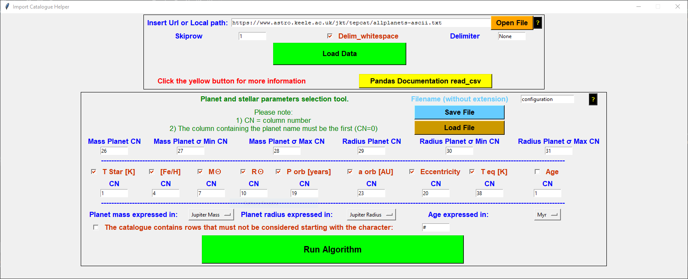
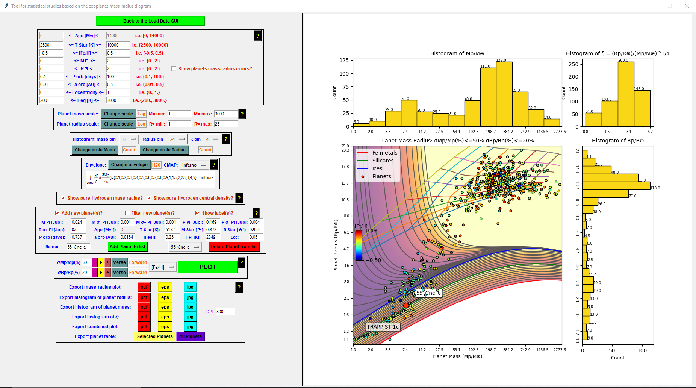

## Summary

We present the python version of the software originally developed with Mathematica by [@Zeng:2021]. 

The code represents a very useful tool for visualizing and manipulating data related to extrasolar planets (or exoplanets, i.e., planets discovered in orbit around stars different from the Sun) and their host stars in a multi-dimensional parameter space. 
Its versatility enables statistical studies based on the large and constantly increasing number of detected exoplanets, to identify possible interdependence among several physical parameters, and to compare observables with theoretical models describing the exoplanet composition and structure.

Our transposition to python presents some new features with respect to the original version, and due to the popularity of python in the astrophysics community, the tool is made accessible by a larger number of users interested in exoplanet studies.

## Purpose of the tool

[@Zeng:2021] presented a software devised to guide the analysis of the mass-radius diagram of extrasolar planets. 

Examining how extrasolar planets, with measured mass and radius, distribute on such a diagram is a key aspect to understand their diversity, and to investigate their physical structure and composition. 
We address the reader to the original paper [@Zeng:2021] for a detailed description of the scientific rationale that inspired this tool. 

Here, we only recall that a main advantage offered by this software is the possibility to connect the planetary mass and radius to many other physical data related to exoplanets and their host stars data. 
Cross-checking data in a multi-dimensional parameter space, and the opportunity to compare the measurements with models of planetary structure and composition, gives the possibility to identify important patterns which can help to interpret observational results on a statistical basis (as for the very interesting case of the so-called "exoplanet radius gap", which has been extensively investigated and discussed by [@Zeng:2021]).

The python version of the code, which is entirely based on the original one, has a few new features and options which, in particular, allow the users to further customize their own analysis, as detailed in the next Section. The modularity of the tool allows to expand it further in the future and increase the size of the parameter space, by including new planetary and stellar parameters, and additional theoretical mass-radius curves.

## Description of the tool and basic instructions

This tool is divided into two different GUIs that call each other. 
Please, note that the frames in each GUI contains a "?" button that displays a message box providing details about the frame contents.

##### First GUI

Fig. 1 shows the GUI that opens when the tool is launched in the terminal. 
This is the interface which allows the user to upload the catalogue containing the planetary and stellar parameters, and to select which ones will be passed to the second GUI for the analysis. 

The GUI is divided into two macro frames:

- The first frame contains all the widgets to import the database in form of a text file. The user can load his own exoplanet catalog both by through a link or by clicking on the "Open File" button and selecting it from a local folder. The link to the on-line TEPCAT cataologue [@Southworth:2011] is provided as the default option. 

- The second frame contains the widgets to specify which data columns from the catalog will be passed to the software for further analysis.
Six columns are mandatory in order to run the tool correctly, i.e., the planet mass and radius and their upper and lower uncertainties (in case there only one column is used to store the error, the user can use the same column index).
The user must provide the column indexes of the selected parameters which correspond to the actual position in the uploaded database. 
The column indexes corresponding to the TEPCAT catalogue are provided by default.
  
Once pressed the "Run Algorithm" button, the set-up information will be transferred to the second GUI, which represents the core of the tool.

##### Second GUI

Mirroring the original tool, the second GUI is divided into two macro frames (Fig. 2). 

The first one (in the left half of the GUI) contains the options and commands that enable the user to produce plots and histograms, which are shown in the second frame.   
It is composed of several sub-frames, which we describe hereafter briefly:

1. The load data frame, which contains only one button which purpose is to load the previous GUI to use another catalog or to change the current import settings.
2. The filter catalog frame, which contains the nine inputs filter related to the nine non-mandatory columns from the first GUI. Those are:
   
   + "Age", the age of the system from which the planet is from, could be in Myr or Gyr, depending on the user choice.
   + "T Star (K)", the surface temperature of the star expressed in Kelvin.
   + "(Fe/H)", the star's metallicity.
   + "M☉", the star's mass expressed in Solar mass.
   + "R☉", the star's radius expressed in Solar radius.
   + "P orb (days)", the exoplanet orbital period expressed in days.
   + "a orb (AU)", the semi-major axes of the exoplanet's orbit expressed in AU.
   + "Eccentricity", the exoplanet's orbit's eccentricity.
   + "T eq (K)", the equilibrium temperature of the exoplanet expressed in Kelvin.

   It also contains a checkbox that (if active) will show the exoplanet's mass and radius errors bars.
   
3. The histogram settings frame, where the user is allowed to change the histograms characteristics, like the amount of bin (one for each histogram, mass, radius, and ζ). He can also choose the "Y" axis scale.
   1. The envelope frame, where the user can plot (or not) the envelope composition choosing between "H2O", "Silicates", "Fe", or "None". It is also possible to choose the CMAP color by selecting one from the proposed (all of them are default matplotlib CMAP).
   2. A frame where the user can use to visualize mass-radius theoretical curves for the iso-entropic pure-Hydrogen composition of the envelope (based on the results of [@Becker:2014]). This feature is not present in the original tool by [@Zeng:2021]. Iso-entropic means that we assume that the specific entropy of the envelope, from the top to the bottom, remains the same due to internal convection. This is usually assumed for deep fluidic envelopes because the presence of an internal heat source from the central region of the planet would drive such convection. The curves are given for specific entropy S = 0.3, 0.4, 0.5, 0.6, 0.7, 0.8, 0.9, and 1.0 (eV/1000K/atom). One could see that both Saturn and Jupiter lie very close to the S (eV/1000K/atom) = 0.3 curves, which is considered to be a relatively cold isentropic profile. The nominal surface of truncation of calculation for these mass-radius curves is taken at a density of 0.01 g/cc
   3. The new planet frame, where the user can add (and eventually plot) planets that are not present in the catalog, to see how they will be plotted in that context. He must compile each enabled text field to correctly add the planet to the list. The user has to click on the green button "Add Planet to list" once all the fields are filled. To delete a planet from the list, the user has to choose the element to delete from the list and then click the red button "Delete Planet from list". It is also possible to choose to filter them by using the current limits imposed for each enabled characteristic, otherwise the planet will be plotted only based on the Mass Radius boundaries. The user can also choose to visualize the labels permanently. 
   4. The running frame, which contains all the widgets used to run properly the internal algorithm and plot the various histograms and graphs. The user can choose a particular upper limit for the error percentage of both mass and radius parameters. To run the current situation (defined by the filters, envelope, and other features) the user has to click the green button "Plot current situation". In case he wants to plot the graphs with a percentage error increased/decreased by one, he could click on the "+"/"-" button corresponding to the parameter (mass or radius) he wants to update. Furthermore, by clicking the "Play" button of the corresponding parameter, the related error upper limit will increase/decrease continuously every four seconds, depending on the verse chosen (Forward/Backward). 
   5. The export frame, where is possible to export the following plot in eps, pdf, or jpg format:
      
      - Mass-Radius plot.
      - Mass histogram.
      - Radius histogram.
      - ζ histogram.
      - All the plots in one picture. 
   
      The user can also export in CSV format the complete exoplanets catalog or the filtered catalog (with the currently applied filters).

## Libraries installation

This tool is developed in Python and uses the Tkinter library to generate both the GUI which is composed by.

The software imports some external libraries (i.e. Pillow, Numpy, Pandas) whose installation commands are:

- tkinter: by default with the python distribution. If not, on Ubuntu, "sudo apt-get install python3-tk", on Windows reinstall Python and select Tkinter package;
- ImageTk: "pip3 install pillow" or "sudo apt-get install python3-pil python3-pil.imagetk" on Linux;
- Numpy: "pip3 install numpy";
- Pandas: "pip3 install pandas";
- matplotlib: "pip3 install matplotlib".
